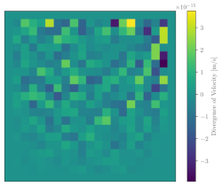

Incompressible Fluid Flow Solvers
=================================

_Written by Mr A. Brierley_\
_Cranfield University_\
_Bedfordshire_\
_UK_

Updated:    _02/12/2025_

Contact me here:    _adambrierley3@gmail.com_

------------------------------------------------

Welcome. This is a repository for studying incompressible fluid flow solvers.

My Master's thesis at Cranfield University primarily involved first psi_omega and then vector_psi_omega.

### Contents

* pp - Pressure-Poisson
* ac - Artificial Compressibility
* fspp - Fractional-Step Pressure-Projection Method
* fsac-pp - fractional-step-artificial-compressibility-pressure-projection
* psi_omega - Streamfunction-Vorticity Formulation (2D)
* vector_psi_omega - Vector Potential-Vorticity Formulation (3D)

