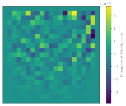

Incompressible Fluid Flow Solvers
=================================

_Written by Adam Brierley_\
_Cranfield University_\
_Bedfordshire_

Updated:    _02/12/2025_

Contact me here:    _adambrierley@proton.me_

------------------------------------------------

Welcome. This is a repository for studying incompressible fluid flow solvers.

My Master's thesis at Cranfield University primarily involved the vorticity-based formulations.

Below are listed all of the various approaches to solving the flow of incompressible fluid numerically.

The vector-potential vorticity formulation (vector_psi_omega), which is applicable for three-dimensional 
fluid flows, has been less exploited historically.

### Contents

* pp - Pressure-Poisson
* ac - Artificial Compressibility
* fspp - Fractional-Step Pressure-Projection Method
* fsac-pp - Fractional-Step-Artificial-Compressibility-Pressure-Projection
* simple - Semi-Implicit Method for Pressure-Linked Equations
* psi_omega - Streamfunction-Vorticity Formulation (2D)
* vector_psi_omega - Vector Potential-Vorticity Formulation (3D)

